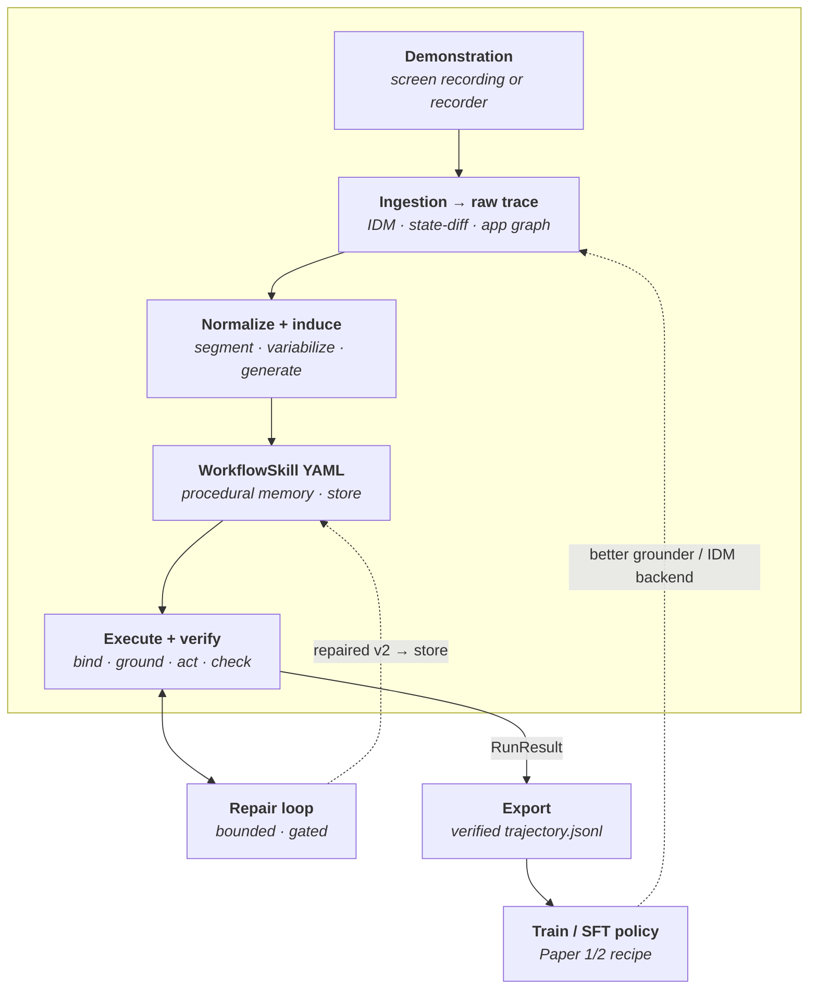
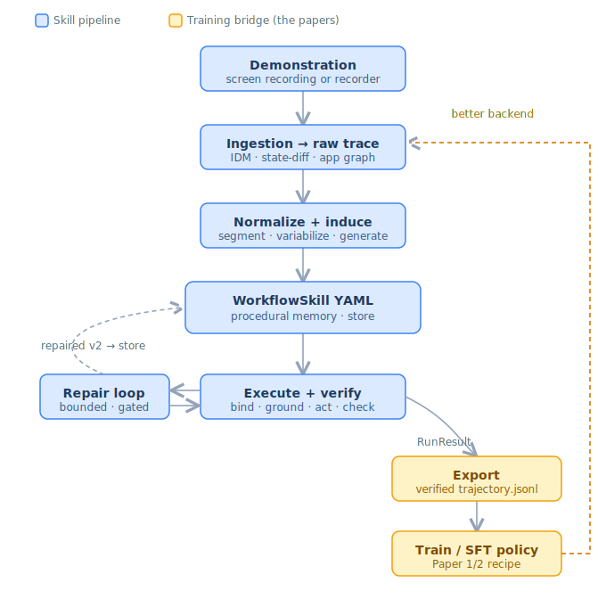

# Architecture: Demo2Skill end-to-end

Status: overview · Scope: the whole system, front to back · Companion to
`video_demo_design.md`

This is the big-picture map of how a demonstration becomes a reusable skill,
how that skill is run reliably, and how the same run feeds two improvement
loops. The organizing idea is **one artifact in the middle and two halves
around it**: everything upstream produces the skill, everything downstream runs
and improves it.

## The diagram

The spine is the Demo2Skill pipeline. The two loops are what make it a
*learning* system: self-healing **repair** (left) and the **training flywheel**
(right). Blue = the skill pipeline; amber = the training bridge (where the
video-mining / screen-parsing papers plug in).

> The rendered SVG version of this diagram is reproduced at the bottom of this
> file for hosts that don't render Mermaid.

## The artifact: the skill YAML is the whole point

Everything upstream exists to produce it; everything downstream exists to run
and improve it. This is the *episodic → procedural* distinction from
`video_demo_design.md` §10:

- A **raw / semantic trace** is *episodic* memory — one specific time a human
  did the task, full of incidental detail (the exact text typed, a stray click,
  one particular path). Replaying it is the brittle script the framework
  rejects.
- The induced **`WorkflowSkill` YAML is *procedural* memory** — the durable,
  parameterized, semantically-targeted "how to do X," stripped of the episode's
  accidents. `WorkflowStore` is the procedural-memory store.

## Front half — acquisition (demo → skill)

A demonstration enters as either an instrumented **recorder** trace (Playwright:
selectors, DOM, screenshots) or a **screen-recording video** (just pixels).

Video is the hard case, and it is where three of the reference papers live:

- an **inverse-dynamics module** recovers actions from frames
  (VideoAgentTrek / Video2GUI — Papers 1/2), in `video/video2action/`;
- the **state-diff engine** (`video/statediff/`) makes that GUI-appropriate —
  element-level before/after state plus cursor evidence determine the action,
  rather than whole-frame visual discontinuity;
- the **GUI transition graph** (`statediff/graph.py`) turns one linear demo into
  a reusable app map (GUI-Xplore — Paper 4);
- a **screen parser** (OmniParser / ScreenParse — Paper 3) is the pluggable
  pixels→state front that feeds the state-diff engine.

All paths converge on a selector-tolerant `raw trace.json`, so `normalize.py`
and the whole induction stack (`segment → variabilize → generate`) run
**unchanged** regardless of source. That convergence is the key design
decision: **modality is isolated to the front of the pipeline; the rest of the
system never knows whether a skill came from pixels or a DOM.**

## Back half — use (skill → reliable execution)

The executor binds inputs, grounds each target, acts, and verifies each step.
This is where reliability is manufactured, and it is **decoupled from
acquisition**: a skill learned from a video can run

- **DOM-grounded** (Playwright) — resolve the semantic target against the live
  DOM; robust to layout shift, preferred for web pages; or
- **pixel-grounded** (VLM → click coordinates) — for native / canvas UIs that
  can't be instrumented.

## The two loops make it *learning*, not just *a parameterized script*

**Repair loop (left) — within-run self-healing.** When a target has moved, the
loop re-grounds semantically, proposes a *minimal* patch, re-validates it
against the Pydantic schema + safety validator, and retries — bounded, with an
oscillation guard, and never able to remove a `request_user_confirmation` gate.
Its dashed return path is the **outer refinement loop**: promote locators that
keep working, demote brittle ones, persist a less-brittle `v2`. The skill gets
better every time it runs.

**Training bridge (right) — the flywheel.** The same verified run that drives
repair is also **exported** — but only the steps the run *confirmed* (status
`ok` / `repaired`) — into `trajectory.jsonl` (`demo2skill/export/`). That feeds
a Paper-1/2-style continued-pretraining / SFT run. The dashed amber arrow closes
the loop: the trained policy returns as a stronger grounder / IDM backend in
ingestion.

So the system improves along **two independent axes at once**: individual skills
get more robust (left loop), and the model underneath the whole pipeline gets
smarter (right loop).

## Why the export seam matters

The repo and the video-mining papers solve the *same* perception problem —
pixels → grounded actions — but make opposite use of the answer. Papers 1–2 pour
recovered actions into **model weights** (implicit, uneditable). The spine turns
them into an **editable skill** (explicit, inspectable). The architecture
refuses to choose: the bridge lets the editable, *verified* skill also become
training data.

The crucial quality argument: Papers 1–2 train on **unverified** IDM output. The
exporter only emits steps the executor + verifier confirmed, so it produces
*filtered, self-corrected* supervision — strictly higher quality than raw mined
video. The exporter is the single seam where the two philosophies meet.

## Module map

| Stage | Package | Role |
| --- | --- | --- |
| Demonstration | `recorder/`, `video/` | capture clicks/typing (DOM) or recover them from frames |
| Ingestion | `video/video2action/`, `video/statediff/` | IDM, state-diff, transition graph → `raw trace.json` |
| Normalize | `trace/` | raw trace → `semantic_trace.json` |
| Induce | `induction/` | segment → variable-abstract → generate skill |
| Skill + store | `workflow/` | Pydantic schema, safety validator, `WorkflowStore` |
| Execute + repair | `executor/` | bind → ground → act → verify, with the repair loop |
| Training bridge | `export/` | verified `RunResult` → `trajectory.jsonl` for SFT |

## Rendered diagram (SVG)

For hosts without Mermaid, the same architecture as a standalone SVG:

